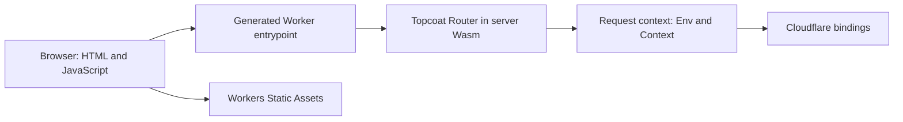

# Architecture

Topcoat owns routing, rendering, browser JavaScript, procedures, and shards. The adapter connects its router and asset bundler to Workers.

## Code map

| Location                                                          | Responsibility                                                                   |
| ----------------------------------------------------------------- | -------------------------------------------------------------------------------- |
| [Runtime crate](../crates/topcoat-cloudflare/src/lib.rs)          | Shared router, request-scoped bindings, streamed responses, cancellation, timers |
| [Native packager](../crates/topcoat-cloudflare-build/src/main.rs) | Extract assets and a private catalog from the raw Wasm build                     |
| [Build integration](../packages/adapter/src/build.ts)             | Run tools and stage a complete deployment before replacing the last good build   |
| [Worker templates](../packages/adapter/templates/)                | Initialize Rust with the catalog and export the SDK entrypoint                   |

The runtime initializes one router per Wasm instance. Each request gets its own environment and execution context through `Router::handle_with`.

`worker-build` compiles Rust and generates SDK glue. The native packager reads that build's assets; the entrypoint supplies the catalog at runtime, avoiding a second Rust compilation.

The npm package carries the templates, tool versions, and native packager source. It operates independently of this checkout. Wrangler owns watching and deployment through its [custom build hook](deployment.md).
