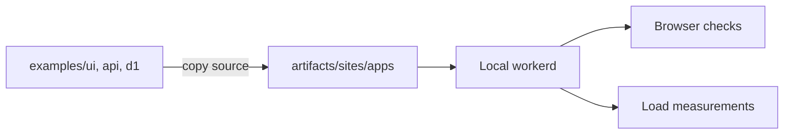

# Benchmarks

Run from the repository root after [test setup](testing.md):

```sh
npm run test:sites -- showcase quiz f4y
npm run benchmark:sites -- showcase quiz f4y
```

The first checks behavior; the second adds load measurements. Choose IDs from the [compatibility matrix](compatibility.md#real-application-coverage), or omit them to run every application and build probe. Both use published adapter packages in local workerd, without a Cloudflare account.



Tests leave your development app and local data untouched. Reports, screenshots, and logs go to `artifacts/sites/`. The [Real applications workflow](https://github.com/kdcokenny/topcoat-cloudflare/actions/workflows/sites.yml) accepts the same IDs and a benchmark toggle.

## Workloads

| Application             | Measured requests                                                          |
| ----------------------- | -------------------------------------------------------------------------- |
| UI showcase, Cold Front | Render the home page                                                       |
| API quiz                | Alternate home and new-quiz pages; controlled local API with a 25 ms delay |
| D1 families             | Three list reads per insert; every acknowledged write checked against D1   |

D1 tests seed 1,000 active and 40 deleted records. Load-created rows are removed before each sample; the soak measures continued growth. Quiz tests never load the public API.

## Method

Release builds pass browser journeys and asset checks before measurement, then deployment packaging afterward. For each application:

1. Warm up with 20 requests.
2. Run three 10-second samples at each concurrency: 1, 8, and 32 clients.
3. Run a 60-second soak at 32 clients.

Each client waits for the complete response before sending another request. Status and content are validated; any load error fails the run. Reports include individual samples, source and package versions, hashes, and host details.

**These measure local regressions, not Cloudflare edge capacity.** The load generator shares the host with workerd. Timings exclude browser interactions and remote API/database latency. Compare matching workloads and hosts; CLI readiness is not isolate cold-start time.

## Maintained example baseline

Pre-release measurements from 2026-09-28: **61,621 responses, zero errors**. Adapter 0.1.0, Topcoat 0.9.0; Linux, two logical CPUs on AMD EPYC 7763.

| Application | Requests/s at 1 / 8 / 32 clients | p95 / p99 at 32 clients | Gzipped Wasm |
| ----------- | -------------------------------: | ----------------------: | -----------: |
| UI showcase |            121.0 / 165.4 / 188.4 |        215.4 / 228.2 ms |    818.0 KiB |
| API quiz    |             56.7 / 256.9 / 298.4 |        171.4 / 214.0 ms |    570.1 KiB |

Values are medians of the three samples; the response total includes soaks. Run the benchmark workflow to produce a current `real-applications` artifact.

## D1 CI baseline

Pre-release measurements from 2026-09-28: **32,423 responses, zero errors, 8,103 verified writes**. Adapter 0.1.0, Topcoat 0.9.0; Linux, two logical CPUs on AMD EPYC 9V74.

| Clients | Requests/s |        p95 / p99 |
| ------: | ---------: | ---------------: |
|       1 |      159.8 |    7.8 / 11.6 ms |
|       8 |      215.9 |   56.2 / 79.4 ms |
|      32 |      245.0 | 189.6 / 234.1 ms |

These medians use the experimental driver described in the [D1 example](../examples/d1/README.md). They do not establish remote D1 performance or support in released Toasty.
